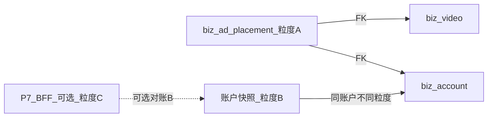

# 数据字典：视频投放/广告运营记录（示意表 `biz_ad_placement`）

| 文档版本 | v0.3.1 |
|----------|------|
| 状态 | 草案；**§6 产品定稿** 已锁定**菜单/口径/并行/投前/展示/RBAC**；与 **`数据字典-视频.md`**、**`数据字典-员工账号.md`** 及 **`Playwright字段定位清单.md` §0.2 T09** 对读。 |
| 拟制日期 | 2026-04-25 |

---

## 0. 同一句「投放/广告」的三种数据粒度（必须区分，防错建表）

| 代号 | 典型落库/出处 | 含义 | 与 Notion/首版的关系 |
|------|---------------|------|----------------------|
| **A** | 本字典示意表 **`biz_ad_placement`**；不来自线索版 Network 抓数 | 单条视频、**矩阵账户**维度上的投放记账：**人填**「**金额/消耗**」+ **投前**快照 + 日期/状态/提醒 等 | **首版主路径** |
| **B** | `biz_account` + **`biz_account_metric_snapshot`** 等，见 [数据字典-员工账号.md `§7`](数据字典-员工账号.md) | 单账户、按日/按批的**总**粉丝、互动、**总投放** 等，将来可来自**广告平台/接口** | 与 A **不是**逐行一一；**禁止**把 A 的按视频行与账户总投放**混成同一列**不加说明 |
| **C** | 线索版 **P7/数据分析** 等 BFF，见 [Playwright字段定位清单.md](Playwright字段定位清单.md) **§0.2 T09、§4** | 平台侧报表/BI 类**指标**；与运营手填金额**可不对等** | **可选**对账源；**首版不**依赖 C 才能录 A |

**防错总原则**

1. **A** 的金额/投前是**本系统**业务事实，**不得**与 **B/C** 混成同一列名、不加前后缀或注释。  
2. **投前**= **本行落库**时锁定的基线；**`biz_video`** 热数据**不**自动覆盖（见 **§6.4**）。  
3. **`dy_video_id`** 只存数字 id，见 [数据字典-视频.md `§2.1`](数据字典-视频.md)。

**关系图（数据流，示意）**

---

## 1. 与主数据外键与唯一性（示意）—与 §6 定稿一致

- **必含**：`tenant_id`；**`dy_video_id`**（FK 语义至 **`biz_video`**）；**`account_id`**（FK 至 **`biz_account`** 矩阵业务账号，且须已存在主数据行）。  
- **按日一行（定稿）**：在**同一** `account_id` + **同一** `dy_video_id` 下，以 **`ad_date`**（业务/自然日边界以产品一句为准）为**日报账维度**落**一行**记当日消耗/金额；**默认**同一自然日、同一 `(account_id, dy_video_id)` 不拆多行，避免对账双计。若以后存在「同一日多次改数」的诉求，**另**在 PRD/权限里约定是**改本行**还是**末次认**，与报表口径一并冻结。  
- **多账户并行（定稿）**：**同** `dy_video_id` **可**同时存在多行，只要 **`account_id` 不同**（**不同**矩阵/广告用号各自记账）。  
- **同账户+同视频「一条当前」（定稿）**：在 **(tenant_id, account_id, dy_video_id)** 上，**同时**至多**一条**记为**当前在投/当前主行**（`is_current = true` 或等价状态）；**不同** `ad_date` 的**历史行**与「按日一行」并存。实现上须用**状态 + 互斥**保证不会出现两条**当前在投**（`is_current` 同时为真）。  
- **建议**：`dy_leads_enterprise_id` 与账号/视频归属同一主体。  
- **与 `biz_video` 的 `account_id`（见 §6.3）**：**`biz_ad_placement.account_id` = 本笔投放所用矩阵号**；**`biz_video.account_id` = 该视频发布方**。两者**可不等**；**UI** 须能对比或分开展示，避免误读。

---

## 2. 与 Notion/界面的列级映射

| 界面/业务 | 建议物理/逻辑列 | 说明 |
|-----------|----------------|------|
| 行**视频** | `dy_video_id` | 与 `https://www.douyin.com/video/{id}` 一致；见**数据字典-视频** `§2.1` |
| **投放/记账用矩阵账号** | `account_id` | FK **`biz_account`**；**不可**仅有昵称 |
| **投放/业务日** | `ad_date` | **按日一行**的日维度 |
| **当日消耗/金额** | `spend_amount` 等 | **人填**；与 **`ad_date`** 同行绑定 |
| **投前赞/评/藏/转** | 四列或 `pre_ad_metrics` + 时间 | **定稿：手填 + 一键从当前 `biz_video` 带入快照** 两种都有（**§6.4**） |
| **是否当前** | `is_current` 等 | 见 **§1、§6.2** |
| 状态/提醒 | `placement_status`，`remind_at` 等 | |

---

## 3. 易错点 清单

1. 把 **B** 的 `dy_ad_spend_total` 与 A 的 `spend_amount` 混到一列不说明口径。  
2. 用 **`biz_video` 最新**赞评覆盖已落库**投前**（**除非**用户在本行上点**重新带入**并明确保存逻辑）。  
3. 忽略**投放** `account_id` 与**发布** `biz_video.account_id` 可不等，**只**显示一个而不说明。  
4. 在**同** `account_id`+`dy_video_id` 下写入**两条** `is_current = true`。  
5. 以为 **T09** 必须完才能做本表（**错**；见 Playwright T09 说明）。

---

## 4. 与立项、推荐视频、Dou+ 的关系

- **推荐视频**用 **`biz_video`** 指标；**本表**的投前/金额**独立**。可同 `dy_video_id` 联动跳转。见 [立项计划书-企业线索采集与分析平台.md](立项计划书-企业线索采集与分析平台.md) 相关节。  
- **Dou+ API**为**可选后续**；**MVP=运营录入+关联主数据**。

---

## 5. 修订 记录

| 版本 | 日期 | 说明 |
|------|------|------|
| v0.1 | 2026-04-25 | 首稿。 |
| v0.2 | 2026-04-25 | 待定稿提示；与 `数据字典-视频` 互链。 |
| v0.3 | 2026-04-25 | 新增 **§6 产品定稿**；**§1/§2** 更新：按日一行、多号并行、同号同视频单 `is_current`、投前 A+B、视频↔账户展示、租户 RBAC。 |
| v0.3.1 | 2026-04-25 | **§6.1**：侧栏产品名 **「广告投放」** 与 Web `ad-placements` 路由对齐 |
| v0.3.2 | 2026-04-25 | **§6.1**：**侧栏正式展示名** 与 **立项/工程** 对齐为 **「投放管理」**；`ad-placements` 不变；与「**视频投放**」业务名、**九项** 一级侧栏 关系见正文 |

---

## 6. 产品定稿（与研发对齐）

> 以下为**业务方一次性确认**内容；**§1、§2** 已按此调整。

### 6.1 菜单位置

- **定稿**：**顶栏/侧栏独立一级菜单**（方案 A），**产品侧栏展示名**：**「投放管理」**（路由示例：`/t/:tenantId/ad-placements`；在**推荐视频**与**控制面**（设备绑定/系统设置）之间**增一项**经营向一级入口）。**说明**：为免与「**视频投放**」（本字典/业务中 **`biz_ad_placement` 所承载的人填、按视频记账** 之统称）与旧稿「**广告投放**」混读，**Web/立项对外菜单名**统一为 **「投放管理」**；**「广告投放」** 可保留为口语或历史别名，**工程/路由/埋点**以 `ad-placements` 与本文 §6.1 为准。与早期立项「仅八项侧栏」如有出入，**以** [`docs/立项计划书-企业线索采集与分析平台.md`](../立项计划书-企业线索采集与分析平台.md) **§3.3.2、附录**（**共九项**一级、含**「投放管理」**）**为准。**

### 6.2 金额日期与多次投放

- **定稿：按日一行**：以 **`ad_date` + 本行 `spend_amount`（等）**表达**该日**的记账。  
- **同一视频可多次投放**：在**不同** `account_id`（**不同**广告/矩阵用号）上，**可并行**多条投放。  
- **同一 `account_id` + 同一 `dy_video_id`**：**同时**至多**一条**「**当前在投/当前主**」记录（`is_current` 或业务等价状态）；**多个**按日历史行**与**本规则不冲突，但「在投的当前」在任意时刻**至多一条**（见 **§1** 互斥）。

### 6.3 视频与员工/矩阵账户（可点可查）

- **定稿**：**视频**与**发布侧**账户在 **`biz_video`** 已关联；**本表**须记录**投放**所用 **`account_id`（矩阵号）**。**列表/详情/从行进入视频**时，须能查看与本笔相关的 **`biz_account` 信息**；并**建议**同屏或链路上**对比/说明** **`biz_video.account_id`（发布方）** 与 **`biz_ad_placement.account_id`（本笔投放所用号）**——两者**可不等**。**若需更细字段、客服/财务口径**，另开需求会，不阻塞本定稿中的表结构与首屏信息架构。

### 6.4 投前 指标

- **定稿**：**手填** 与 **一键从当前 `biz_video` 带入快照** **两者都要**；带入**仅**在**用户操作**时**写入本行/本次**，**不**随后续 `biz_video` 同步**自动**更新。

### 6.5 权限（租户可配子账户）

- **定稿**：在**租户内**支持为**不同**子账户/角色配置**是否可编辑** **视频投放** 数据（可与**「系统设置」/RBAC**合表，或单设权限点，如 `ad_placement:write` 或等价命名，**以最终后台实现为准**）。无编辑权的用户**只读或不可见**，按**现有**租户安全策略套。
